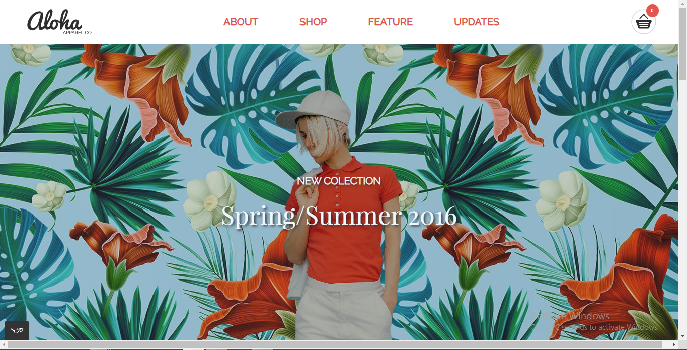

## Inhabitent

**version 1.0.0

aloha is a sigle-page website for fashion shopping.

## Quick start

* Clone the git repo — `git clone
  https://github.com/ermia-afshaian/alohap1.git`  

## Personal learnings

* full grasp of the concept of css
* how to use plugins (such as bootstrap plugins)
* how to effectively make a mobile-first responsive website.
## contributers

-ermia afsharian
## License

The code is available under the [MIT license](LICENSE.txt).